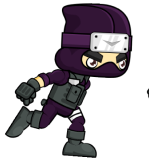
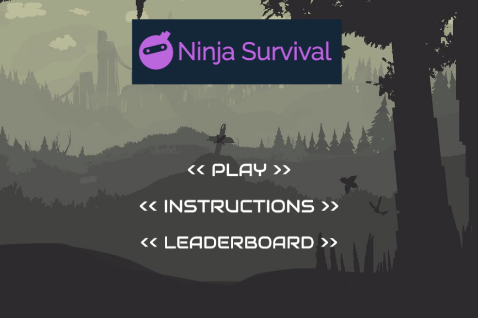
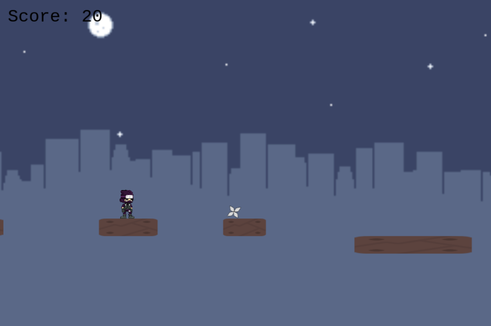
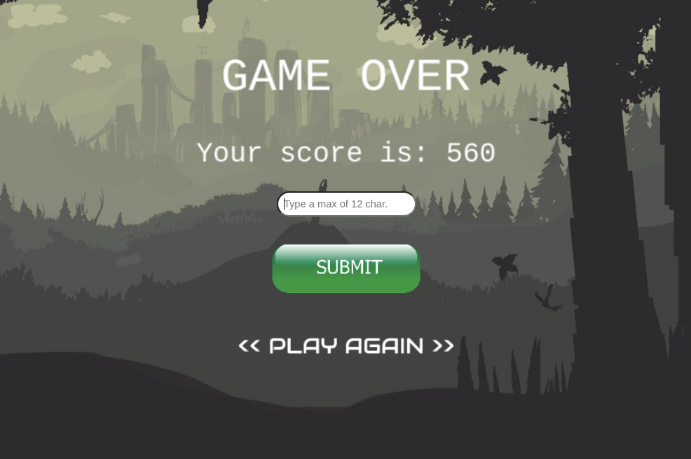
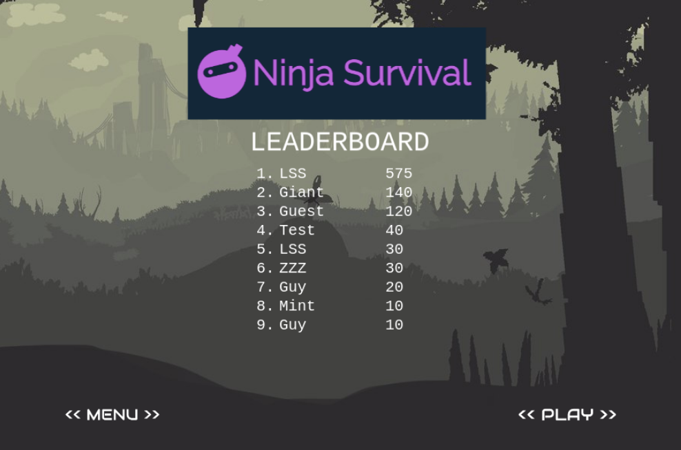

# Javascript Capstone Project : Ninja Game
  
## About
This project is part of the Microverse Curriculum projects. The game is meant to be a platform game for the final project of the Javascript curriculum, 
and was developed using Phaser 3.

## Project specifications
* [Requirements](https://www.notion.so/Platform-game-4a55a7d1fcc245bcb012c76814764712)

## Tha Game

- The main character is a ninja that run trough a world dominated by an evil AI in the year 2320. The first stage and main scene of this game is where our hero has to collect ninja-stars and kunais(knifes) to get points. The goal is to collect as many weapons as you can to be able to fight enemies in next stages(to be design).

- Make sure to jump at the right moment because platform appears at different height and move at different speed.

- The main characters and items where taken from [Open Game Art](https://opengameart.org/).

### Live Version

* [Play the Game](https://still-river-44514.herokuapp.com/)

### How to play

* You can use the up arrow key to jump over the infinite platforms.
* Use the left and right arrow keys to move and redirect your jump.
* The only way to survive is to mantain yourself above the platforms.

#### Install

You can use the [live version](https://still-river-44514.herokuapp.com/) or you can install it in your local machine

#### Clone this repository

``` $ git clone https://github.com/nriqu322/ninja-game.git ```

#### Go to the folder

``` $ cd ninja-game ```

#### Install all dependencies

``` $ npm install ```

#### Run the server

``` $ node server.js ```

#### Open your browser and type

localhost:8080

### Hero & Items

#### Ninja


- Role: Main character

#### Ninja-Star


- Item : collectable
- Role : weapon

#### Kunai


- Item : collectable
- Role : weapon

### Scenes

#### Main Menu : Where you can see three links: Play the Game, Instructions and Leader Board.


#### Play : Run for you life and to get the highest score.


#### GameOver : See your obtained score and type your name.


#### LeaderBoard : Check if you manage to appear in the Leader Board.


## Build with
* JavaScript
* Webpack
* Phaser 3
* Express
* Babel
* Jest
* Heroku
* Leaderboard API service
* ESlint and Stylelint as linters

## Available scripts
You can use ``` npm run {script here} ``` with the following commands :

- "test": "jest"
- "build": "webpack --mode production".
- "watch": "webpack --mode development --watch"

## Future Features
* Ability to throw collected ninja stars and kunais
* More stages
* Add enemies to fight

## Author

👤 **Luis Saavedra**
- Github: [@nriqu322](https://github.com/nriqu322)
- Twitter: [@nriqu322](https://twitter.com/nriqu322)
- Linkedin: [Luis Saavedra](https://linkedin.com/in/luis-saavedra-sanchez/)

---

## 🤝 Contributing

Contributions, issues and feature requests are welcome!

Feel free to check the [issues page](issues/).

## Show your support

Give a ⭐️ if you like this project!

## Acknowledgments

[Microverse](https://microverse.org)

---
